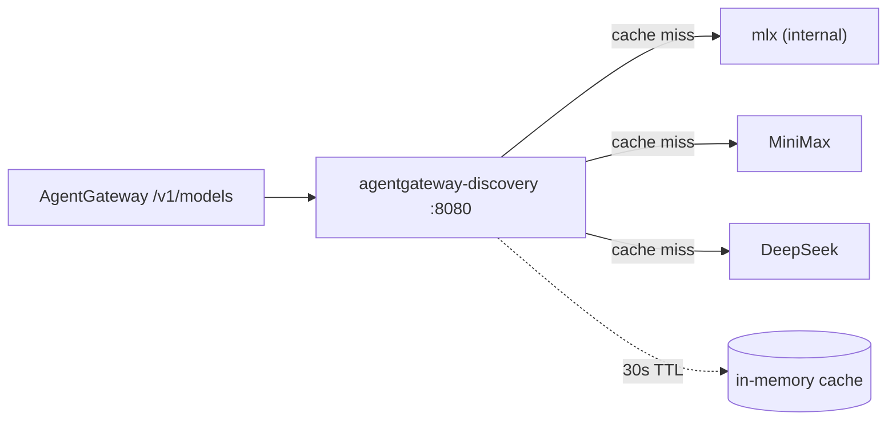

# agentgateway-discovery

On-demand `/v1/models` aggregator for AgentGateway. Queries each upstream LLM provider's `/v1/models` endpoint live and merges the results into a single OpenAI-compatible list, cached in memory for 30 s.



## Run

```bash
bazel run //agentgateway-discovery:load
docker run --rm -p 8080:8080 \
  -e MINIMAX_API_KEY=... \
  -e DEEPSEEK_API_KEY=... \
  agentgateway-discovery:latest
```

## Config

| Env var           | Default | Purpose                                       |
| ----------------- | ------- | --------------------------------------------- |
| `PORT`            | `8080`  | Listen port                                   |
| `MINIMAX_API_KEY` | (unset) | Bearer token for `api.minimaxi.chat`         |
| `DEEPSEEK_API_KEY`| (unset) | Bearer token for `api.deepseek.com`          |

The `mlx` provider targets `http://mac.internal:8080/v1/models` and never sends an Authorization header. Other providers send `Authorization: Bearer <env>` only when the env var is non-empty.

## Endpoints

| Method | Path        | Response                                                 |
| ------ | ----------- | -------------------------------------------------------- |
| `GET`  | `/v1/models`| OpenAI-compatible merged model list (cached 30 s)        |
| `GET`  | `/healthz`  | `200 ok` (liveness + readiness probes)                   |
| any    | other       | `404`                                                    |