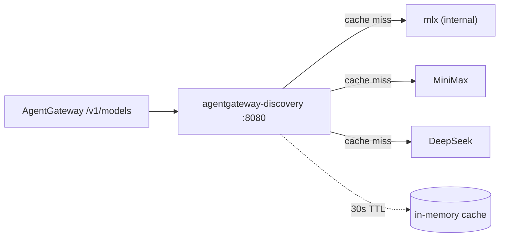

# agentgateway-discovery

On-demand `/v1/models` aggregator for AgentGateway. Queries each upstream LLM provider's `/v1/models` endpoint live and merges the results into a single OpenAI-compatible list, cached in memory for 30 s.



## Run

```bash
bazel run //agentgateway-discovery:load
docker run --rm -p 8080:8080 \
  -e MINIMAX_API_KEY=... \
  -e DEEPSEEK_API_KEY=... \
  agentgateway-discovery:latest
```

## Config

Providers and their API keys come from env vars. Recognized variables:

```
DISCOVERY_PROVIDER_<NAME>_URL=https://...          (required per provider)
DISCOVERY_PROVIDER_<NAME>_API_KEY=<bearer-token>   (optional)
```

`<NAME>` is lowercased and used as the provider identifier (logs and `owned_by` default). If no `DISCOVERY_PROVIDER_*` env vars are set, three built-in defaults are used:

| Provider  | URL                                          | Auth         |
| --------- | -------------------------------------------- | ------------ |
| `mlx`     | `http://mac.internal:8080/v1/models`         | none         |
| `minimax` | `https://api.minimaxi.chat/v1/models`        | via env      |
| `deepseek`| `https://api.deepseek.com/v1/models`         | via env      |

Other env vars:

| Env var | Default | Purpose     |
| ------- | ------- | ----------- |
| `PORT`  | `8080`  | Listen port |

In Kubernetes, source each provider's API key from its own Secret via `valueFrom.secretKeyRef`:

```yaml
env:
  - name: DISCOVERY_PROVIDER_MLX_URL
    value: "http://mac.internal:8080/v1/models"
  - name: DISCOVERY_PROVIDER_MINIMAX_URL
    value: "https://api.minimaxi.chat/v1/models"
  - name: DISCOVERY_PROVIDER_MINIMAX_API_KEY
    valueFrom: { secretKeyRef: { name: minimax-auth, key: MINIMAX_API_KEY } }
  - name: DISCOVERY_PROVIDER_DEEPSEEK_URL
    value: "https://api.deepseek.com/v1/models"
  - name: DISCOVERY_PROVIDER_DEEPSEEK_API_KEY
    valueFrom: { secretKeyRef: { name: deepseek-auth, key: DEEPSEEK_API_KEY } }
```

## Endpoints

| Method | Path        | Response                                                 |
| ------ | ----------- | -------------------------------------------------------- |
| `GET`  | `/v1/models`| OpenAI-compatible merged model list (cached 30 s)        |
| `GET`  | `/healthz`  | `200 ok` (liveness + readiness probes)                   |
| any    | other       | `404`                                                    |