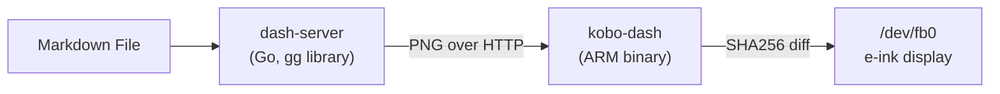

# kobo

E-ink dashboard for Kobo e-reader. Server renders markdown to PNG, client writes it to the Kobo framebuffer.



## Components

| Dir | What |
|-----|------|
| `dash-server/` | Renders markdown → PNG (fogleman/gg) |
| `kobo-dash/` | Fetches PNG, writes to framebuffer via mxcfb ioctls |

## Build

```bash
bazel run //kobo/dash-server -- --addr :8080 --file /data/dashboard.md --width 1072 --height 1448
bazel build //kobo/kobo-dash   # ARM cross-compile for Kobo
```
