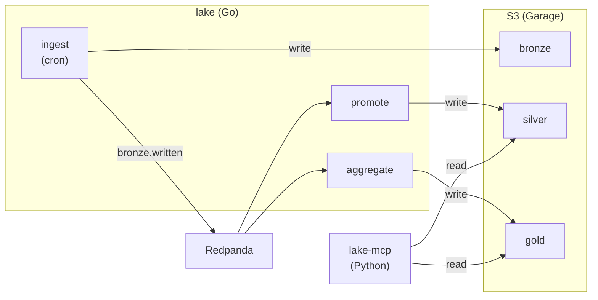

# lake

Medallion architecture data lake (bronze/silver/gold S3 buckets) with event-driven promotion via Redpanda.

## Architecture



## Data Sources

- **RBA** — Reserve Bank of Australia statistical tables
- **ABS** — Australian Bureau of Statistics
- **AEMO** — Australian Energy Market Operator
- **RSS** — RSS feed collector with full article extraction
- **Reddit** — Subreddit data
- **Domain** — Property listings
- **NSW VG** — NSW Valuer General

## Build

```bash
bazel build //lake:ingest //lake:promote //lake:aggregate
```

## Deploy

Container images built via `rules_oci` and pushed to GHCR. Deployed to k8s via FluxCD.

```bash
bazel run //lake:push_ingest -- --tag latest
bazel run //lake:push_promote -- --tag latest
bazel run //lake:push_aggregate -- --tag latest
```
