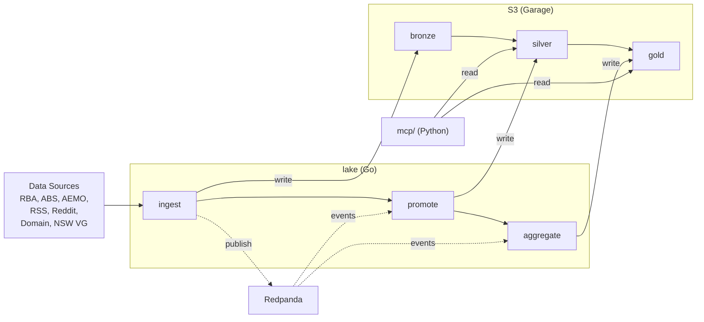

# lake

Medallion architecture data lake. Ingests Australian macro-financial data into S3 (Garage), promotes through bronze/silver/gold layers via Redpanda events.



## Services

| Target | What |
|--------|------|
| `//lake:ingest` | Cron-based data ingestion from external sources |
| `//lake:promote` | Event-driven bronze → silver promotion |
| `//lake:aggregate` | Event-driven silver → gold aggregation |
| `mcp/` | MCP server exposing data to AI agents (FastMCP + Pydantic AI) |

## Build

```bash
bazel build //lake:ingest //lake:promote //lake:aggregate
```
