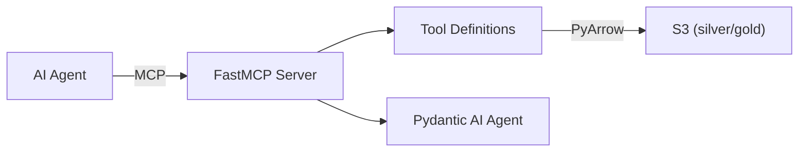

# lake/mcp

MCP server exposing the data lake to AI agents via Model Context Protocol.



## Stack

Python 3.12, FastMCP 2.0, Pydantic AI, PyArrow, httpx, feedparser

## Run

```bash
uv pip install -e . -e ../../libs/datalake
python -m lake_mcp
```

Requires: `S3_ENDPOINT`, `S3_ACCESS_KEY`, `S3_SECRET_KEY`, `S3_REGION`
