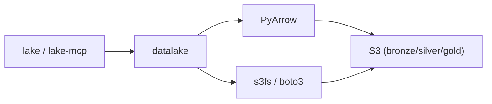

# libs/datalake

Shared Python library for reading/writing Parquet files to S3 medallion layers.



## Install

```bash
uv pip install -e libs/datalake
```

## Config

Env vars: `S3_ENDPOINT`, `S3_ACCESS_KEY`, `S3_SECRET_KEY`, `S3_REGION`

## Modules

`client.py` (S3 client), `reader.py` / `writer.py` (Parquet I/O), `config.py`, `schemas.py`
