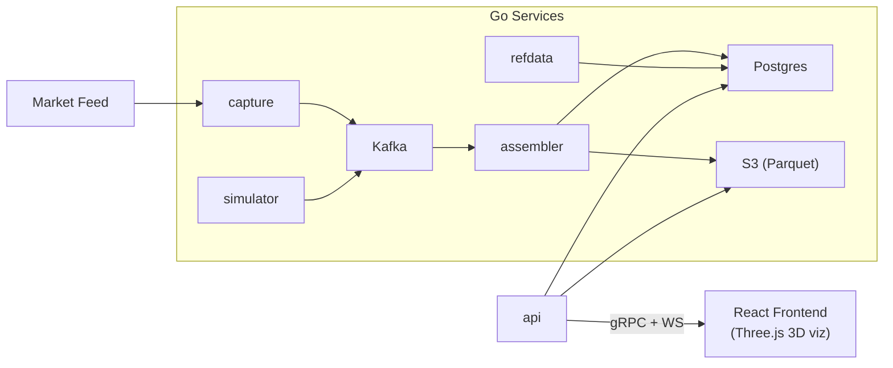

# line

Real-time market data platform. Captures, assembles, and serves market data via Kafka, Postgres, S3, and gRPC.



## Services

| Service | What |
|---------|------|
| `cmd/capture` | Ingests raw market data |
| `cmd/assembler` | Aggregates into Postgres + S3 |
| `cmd/simulator` | Generates synthetic data |
| `cmd/api` | Serves via gRPC + WebSocket |
| `cmd/refdata` | Reference data management |
| `cmd/migrate` | Database migrations (goose) |

## Build

```bash
bazel run //line/cmd/api
cd line/web && pnpm dev
```

## Stack

Go: franz-go, pgx/v5, aws-sdk-go-v2, parquet-go, gRPC, gorilla/websocket
Web: React 19, Three.js/R3F, Recharts, TailwindCSS 4, Vite
