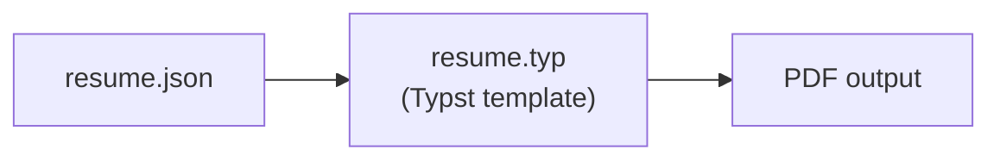

# resume

Resume/CV rendered from structured JSON using Typst.


```mermaid
graph LR
    data["resume.json"] --> typst["resume.typ<br/>(Typst template)"]
    typst --> pdf["PDF output"]
```

## Build

```bash
bazel build //resume
```
