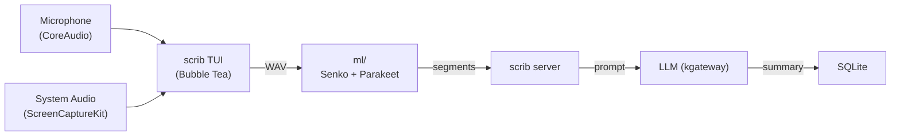

# scrib

Meeting audio capture, transcription, and annotation. Records system + mic audio on macOS, sends to ML pipeline for diarization and transcription, summarises via LLM.



## Components

| Dir | What |
|-----|------|
| `.` | Go CLI/TUI + HTTP server |
| `audio/` | macOS audio capture (ScreenCaptureKit + CoreAudio, cgo) |
| `ml/` | Python ML pipeline — diarization (Senko) + transcription (MLX Parakeet) |
| `tui/` | Bubble Tea terminal UI |
| `server/` | HTTP server (transcription orchestration) |
| `client/` | HTTP client for server API |

## Usage

```bash
scrib standup              # TUI: record + process
scrib record standup       # headless recording
scrib annotate file.wav    # post-hoc processing
scrib history              # list meetings
scrib search "topic"       # FTS across transcripts
```

## Build

```bash
cd scrib && go build -o ~/bin/scrib .       # client (macOS only)
bazel build //scrib:scrib-server            # server image
```

## Requirements

macOS 13+ (ScreenCaptureKit), ml/ server on :8000, kgateway on :8001
