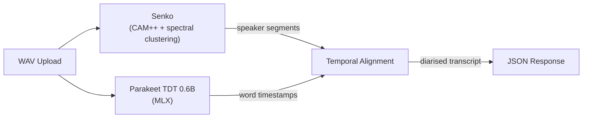

# scrib/ml

ML audio pipeline for scrib. Three-stage: diarize → transcribe → align. Apple Silicon only.



## API

| Endpoint | What |
|----------|------|
| `POST /v1/audio/process` | Full pipeline |
| `POST /v1/audio/diarize` | Speaker diarization only |
| `POST /v1/audio/transcribe` | Transcription only |
| `GET /health` | Health check |

~21s for 9min audio on M4.

## Run

```bash
uv run python -m scrib_ml.server --host 127.0.0.1 --port 8002 --workers 1
```

## Deploy

Runs as launchd agent (`com.scrib.ml`) on Mac Mini via nix-darwin. Preloads models on startup.
