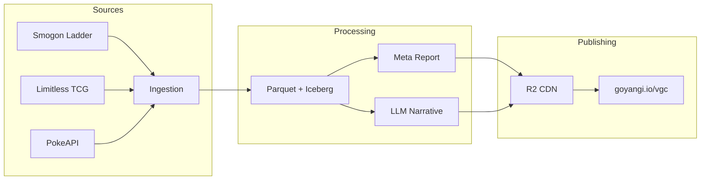
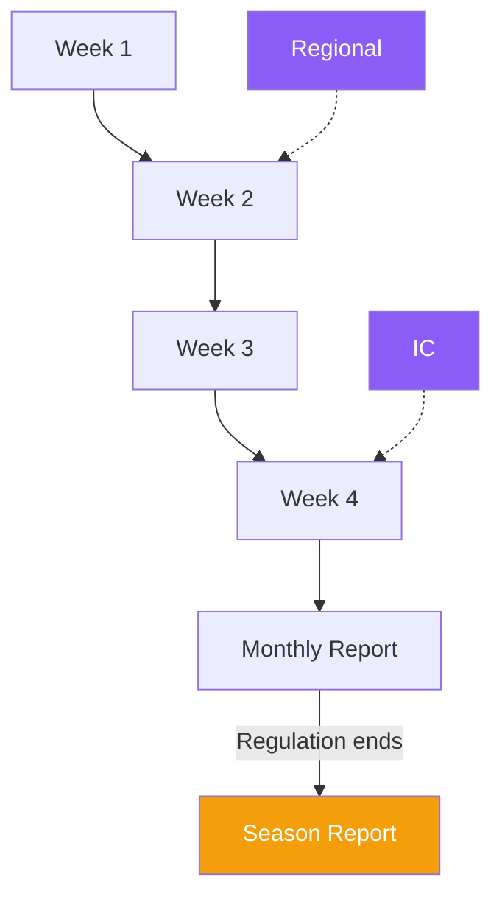

Competitive Pokemon VGC has a surprisingly rich data ecosystem. Smogon publishes raw ladder statistics as structured JSON, Limitless TCG exposes tournament results via API, and the damage calculator is open source. The data is all there — it just needs a pipeline to make it useful.

## The pipeline

A weekly CronJob pulls data from three sources, writes to a lakehouse (Iceberg on Garage S3), generates an interactive report with [marimo](https://marimo.io), and publishes to the website. A Gemma 4 model writes a short meta commentary via agentgateway.

## Data sources

**Smogon chaos JSON** is the primary source. They publish per-Pokemon usage data for every competitive format — abilities, items, EV spreads, moves, tera types, teammates — across multiple ELO brackets. This is the ladder: millions of games, updated continuously.

**Limitless TCG** provides tournament results. Full team sheets from real events with placements. This is what actually wins — and it doesn't always match what's popular online.

**PokeAPI** gives us base stats. Needed for computing real speed tiers rather than just looking at EV investment in isolation.

## What we analyse

### Speed tiers

Most meta resources show EV spreads. That's only half the picture. What actually matters is the final speed stat at level 50 — accounting for base stats, EVs, and nature. The report computes this for every popular spread across the top 30 Pokemon, weighted by popularity.

This produces a single "meta speed" number. Is the format fast and offensive, or slow and bulky? Are teams investing in speed control or dumping everything into survivability? You can see this shift week to week as the meta adapts.

### Ladder vs tournaments

What's popular on ladder doesn't always win events. The pipeline merges both datasets and highlights the gap — Pokemon that are "tournament-favoured" versus "ladder-only" picks. This surfaces strategies that reward preparation and matchup knowledge, which is exactly what you want to know heading into a regional.

### Anti-meta picks

By comparing usage across ELO brackets (1500 vs 1760+), we can find Pokemon that see disproportionate play at high ELO. These tend to be tech picks and skill-intensive strategies — the kind of things that only work when you know exactly what you're targeting.

### Team cores

Pokemon that consistently appear together. High co-usage rates signal format-defining combinations. If two Pokemon show up on 25%+ of each other's teams, that's a core you need to either run or have an answer to.

## Seasonal analysis

Weekly reports track the meta in motion. Tournament dates are pinned so you can see how the ladder shifts in response to major events. When a regulation ends, a comprehensive season report captures the full arc — what dominated, what fell off, how the meta evolved from week one to the final.

## The calc service

The damage calculator ([`@smogon/calc`](https://github.com/smogon/damage-calc)) runs as a standalone HTTP service in the cluster. TypeScript bundled into a single file, always available. Any part of the system can ask "does this move KO?" without needing Node.js locally. Useful for the pipeline, and eventually for an interactive teambuilder.

## Infrastructure

Built in a Bazel monorepo, deployed via FluxCD to a home Kubernetes cluster. Two OCI images: one for the Python pipeline (ingestion, analysis, reports), one for the Node.js calc service. Iceberg tables on Lakekeeper make the raw data queryable beyond just the published reports. Reports land on Cloudflare R2 behind the CDN.

## What's next

- Interactive dashboard (marimo server mode — explore data on demand)
- Showdown replay ingestion (leads, KOs, win conditions)
- Historical trend lines across regulation lifecycles
- End-of-regulation season reports before format rotations
