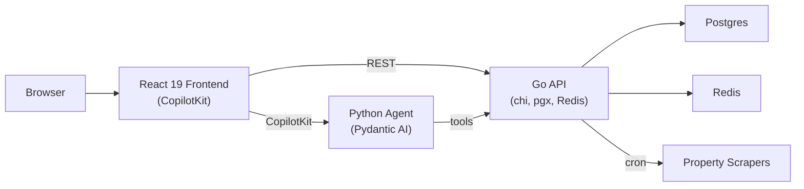

# yield

Property investment analysis — rent fairness scoring, investment metrics, AI-powered property agent.



## Components

| Dir | What |
|-----|------|
| `api/` | Go backend — chi/v5, pgx/v5, go-redis/v9, goose, go-shp, cron |
| `agent/` | Python AI agent — pydantic-ai, fastapi, copilotkit |
| `web/` | React 19 — CopilotKit, React Router 7, TailwindCSS 4, Vite |

## Run

```bash
bazel run //yield/api              # API
uvicorn yield.agent.serve:app      # Agent
cd yield/web && pnpm dev           # Frontend
```
